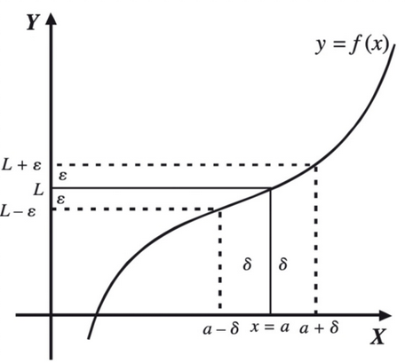

# TP 0 - Presentación

| Legajo  | Nombre                    |
|:-------:|:-------------------------:|
|233.799-0|Facundo Valentín Costarella|

**Sobre mí**: Tengo experiencia con varios lenguajes de programación conocidos (C, C++, Java, JavaScript, Python) y específicamente me interesa la lógica o el comportamiento interno de los programas más que, por ejemplo, el diseño de su interfaz. También tengo cierto interés en la música, los idiomas, y las matemáticas, entre otras cosas.

No estoy seguro qué más agregar, pero hace un tiempo aprendí cómo escribir algunas fórmulas mátemáticas con $\LaTeX$ (mayormente con ayuda de [este machete](https://pages.uoregon.edu/torrence/391/labs/LaTeX-cheat-sheet.pdf)) y lo usé para un par de trabajos prácticos, así que acá les dejo escrita manualmente la **definición formal del límite**:

$$
\lim_{x\to a}f(x)=L
\Longleftrightarrow
\forall\varepsilon>0:
\exists\delta(\varepsilon)>0:
0<|x-a|<\delta \Rightarrow |f(x)-L|<\varepsilon
$$

  

